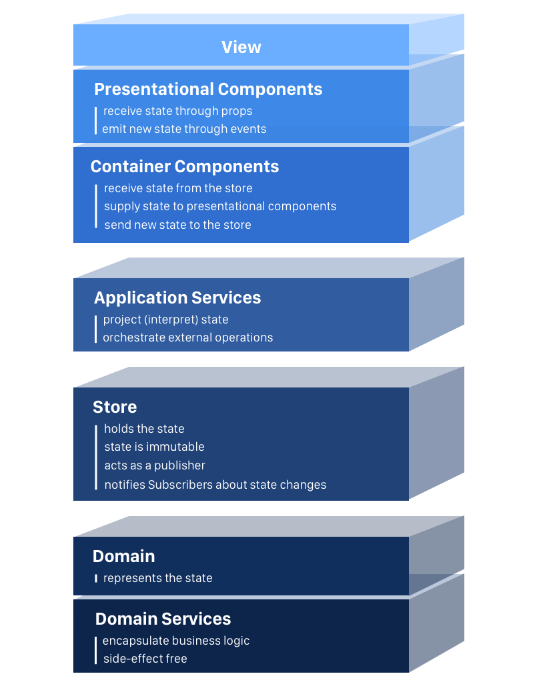

# Spring Boot + React Demo
Demo of using a Single Page Application (React) sitting on nginx with a proxy to an API written in Spring Boot

# Pre-reqs

  - [Java 8](https://openjdk.java.net/install/)
  - [NodeJS](https://nodejs.org/en/)
  - [Docker](https://www.docker.com/get-started)
  - [Docker Compose](https://docs.docker.com/compose/gettingstarted/)

---
Since we are seperating presentation from the logic, let's look at the shift from traditional MVC to API driven 
frontends.

## Backend (API)

### Patterns for implementing 

### patterns continued...

## Frontend (UI)

### Modern Web Application (Single Page App)

### Single Page Application Architecture

### Using Flux to manage state

License
----
BSD