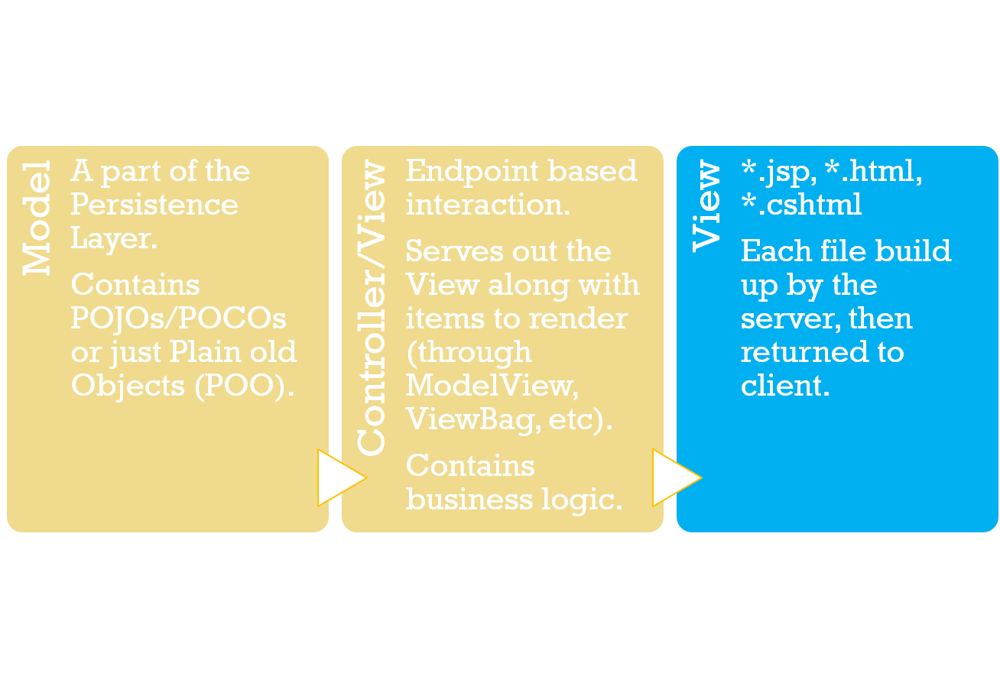
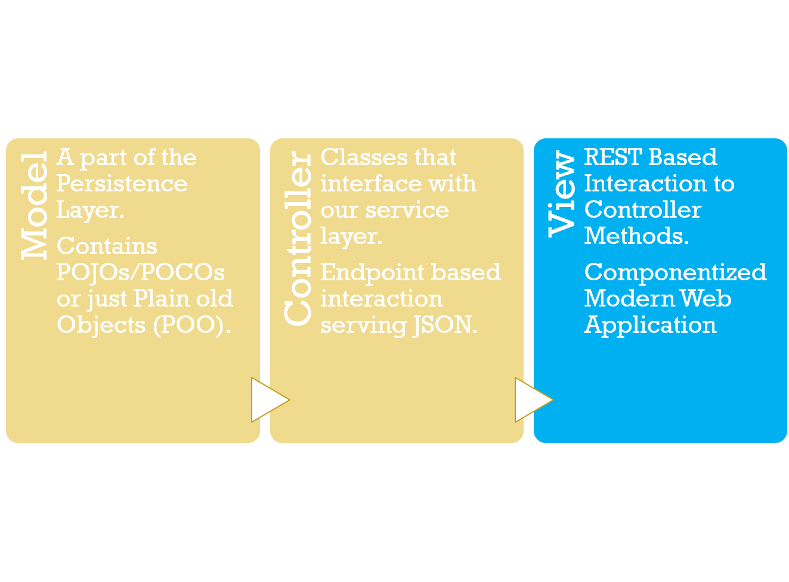
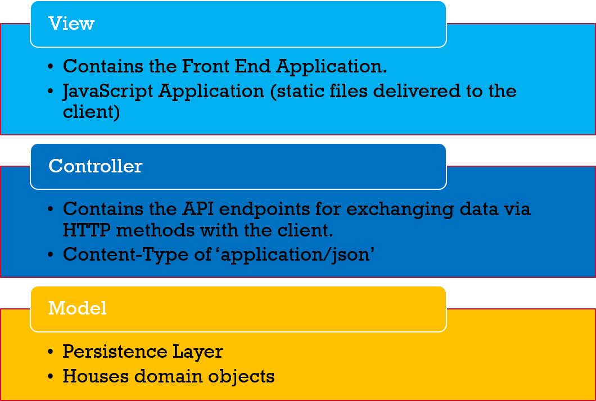
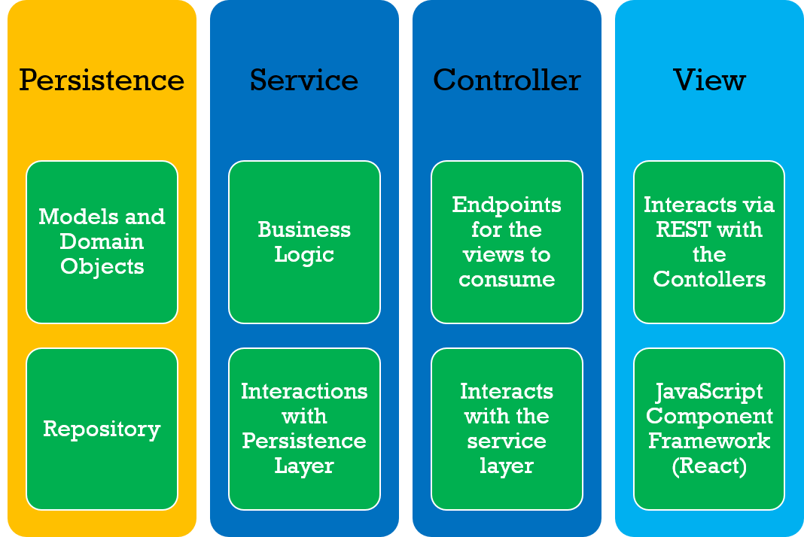
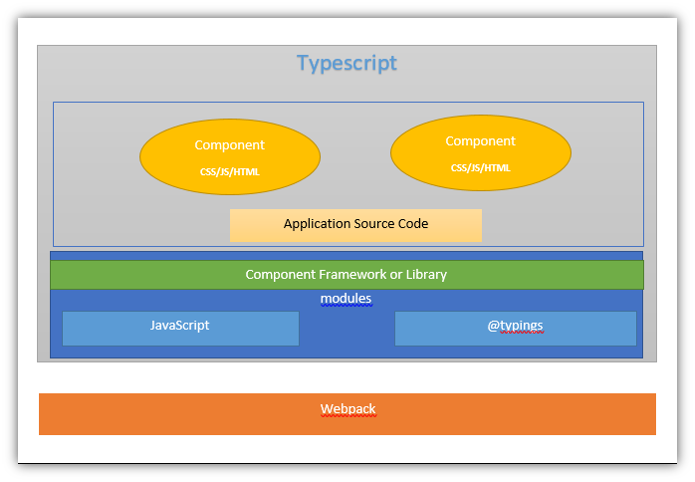
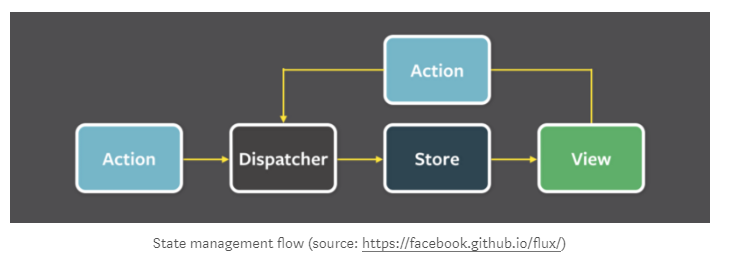

# Spring Boot + React Demo
Demo of using a Single Page Application (React) sitting on nginx with a proxy to an API written in Spring Boot

# Pre-reqs

  - Java 8
  - NodeJS
  - docker
  - docker-compose

### Separation of Concerns

### Backend (API)

### Frontend (UI)

License
----
BSD